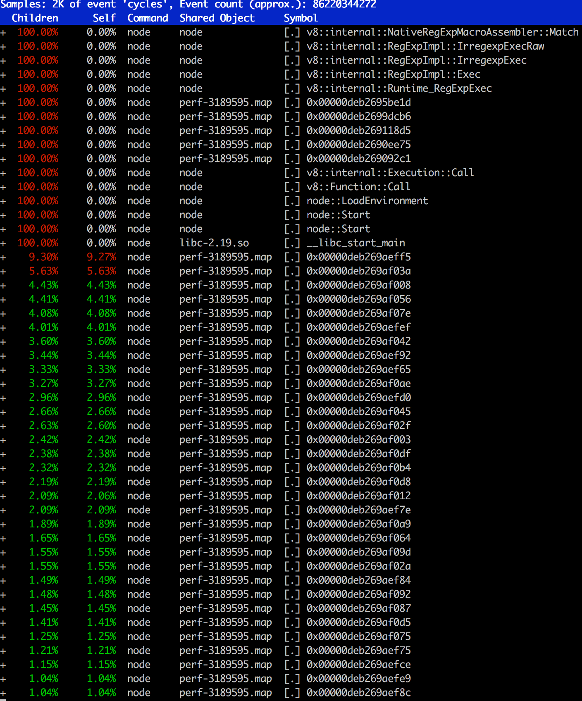
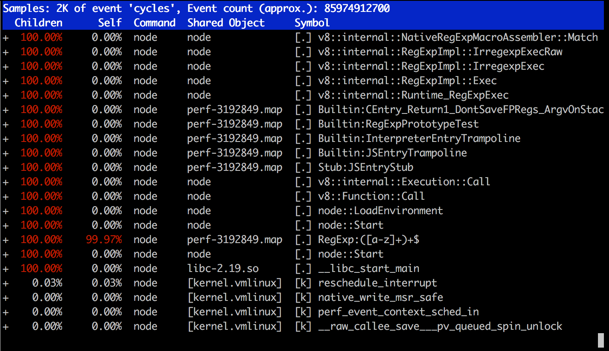
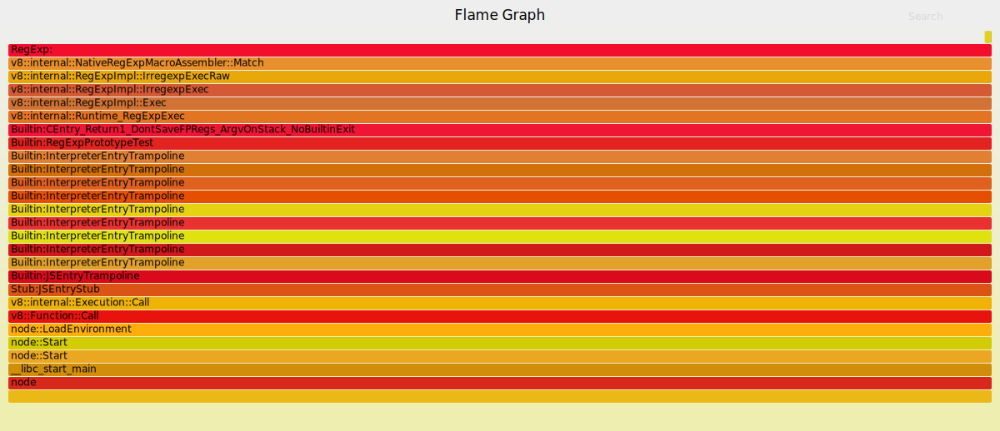
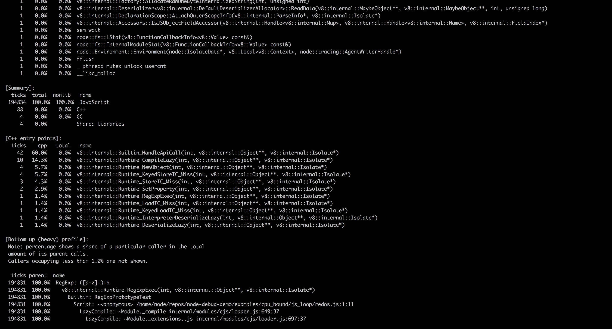
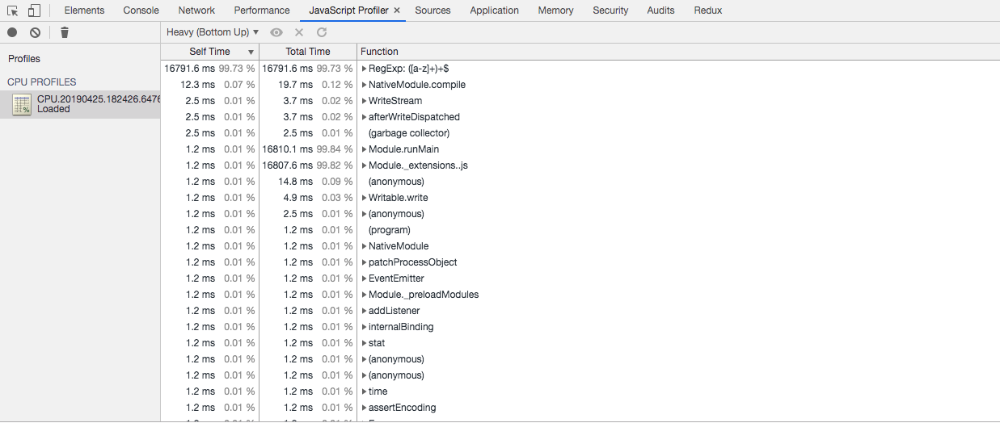
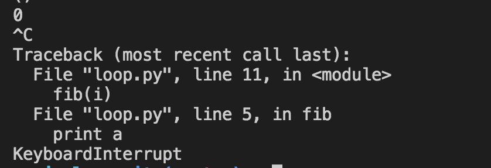

# 定位CPU 100%问题
## perf
```
node redos.js
perf record -F 99 -p `pgrep -n node` -g -- sleep 30
perf report
```

根据这个信息可发现正则都花在了正则上，但是只有c++的代码，并没有js的信息

## perf + node --perf-basic-prof
```
node --perf-basic-prof redos.js
perf record -F 99 -p `pgrep -n node` -g -- sleep 30
perf report
```

此时包含了更多的信息如大量的时间花在了`RegExp:([a-z]+)+$`这个正则上

## perf + 火焰图
```
node --perf-basic-prof redos.js
perf record -F 99 -p `pgrep -n node` -g -- sleep 30
perf script > out.nodestacks01
git clone --depth 1 http://github.com/brendangregg/FlameGraph
cd FlameGraph
./stackcollapse-perf.pl < ../out.nodestacks01 | ./flamegraph.pl > ../out.nodestacks01.svg
```


### node + prof
v8有一个内置的性能分析工具，可以记录Javascript/C/C++的堆栈信息，该功能是默认关闭的，可以通过添加命令行参数--prof开启。
```
node --prof redos.js
node --prof-process isoloate-{id}.log > process.txt
```
生成的process.txt内容如下

图片可以看出大部分的时间花在`RegExp: ([a-z]+)+$`

### cpu profile
node是基于v8引擎的，同时v8暴露了一些profiler API,我们可以通过v8-profiler来收集一些运行时数据，缺点是因为v8-profiler只能通过js
进行触发，这意味着一旦程序出现了死循环等情况，无法触发profile了.
是node 12可以通过--cpu-profile 来支持生成profile，其他node版本可以通过v8-profiler模块来生成profile文件。
```
node --cpu-prof redos.js
```
其会自动生成`CPU.${yyyymmdd}.${hhmmss}.${pid}.${tid}.${seq}.cpuprofile`的文件，可以通过浏览器的javascript profile来读取该文件

我们观察可得，99%的时间花在了`RegExp([a-z]+)+$`这个正则解析上。

然而现在仍然不能通过信号来生成profile文件，相关issue https://github.com/nodejs/node/issues/24937，但是python等出现死循环通过^C是可以查看陷入死循环的程序的当前调用栈的。这算node的一个小缺陷吧。
