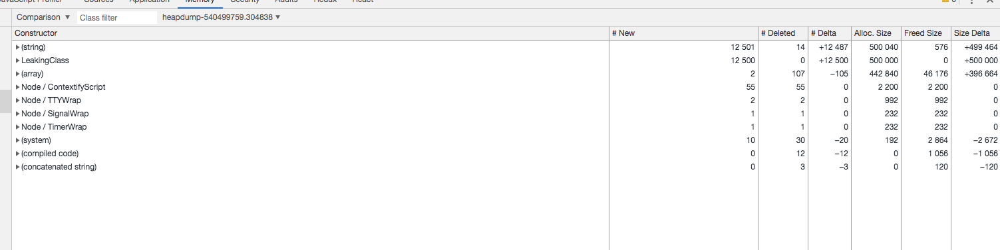

### heapdump
```
$ node app.js
$ kill -SIGUSR2 `pgrep -n node`
$ kill -SIGUSR2 `pgrep -n node` // 10s later
```
生成如下diff图


heapdump虽然能够生成快照，但不能自动监测到内存泄漏，通过node-memwatch模块可以自动的帮我们监听内存泄漏（连续5次GC后都是增长），通常将node-memwatch和heapdump配合使用，node-mewatch监听内存泄漏，内存泄漏后使用heapdump生成内存快照，然后对比快照文件，从而分析内存泄漏的地方。

```
$ node --expose-gc app_memwatch.js
$ ab -c 1 -n 5 http://localhost:3000
```